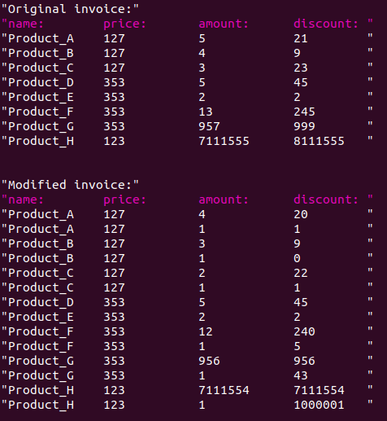

 If discount divides by amount with remainder, we divide amount and discount into parts so that it is without remainder.



## How to build (Ubuntu 20.04)
```
git clone <this_repo>
cd <this_repo>
git checkout master
git pull
mkdir build
cd build
qmake ..
make
```

